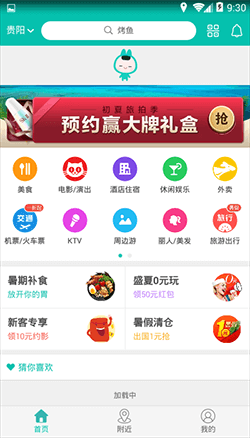
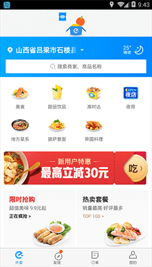
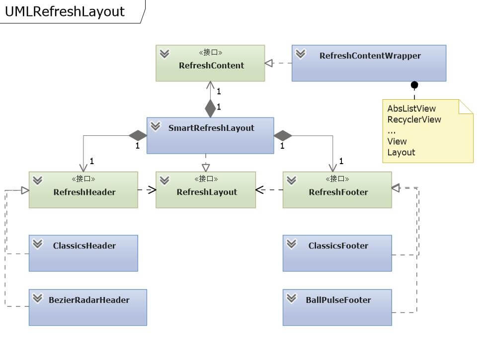

# 自定义Header和Footer

## 把情感化设计的APP卡通形象植入APP界面当中
稍微大一点的互联网公司都有属于自己的企业或app的卡通吉祥物。这些品牌元素都是我们
app设计师发挥创意设计的好素材。 也是需要我们巧妙植入到我们APPui界面设计当中去的
最重要的元素。   
比如美团、饿了吗、天猫。。。

  

## 安卓下拉刷新框架
SmartRefreshLayout被设计为一个刷新框架，具有非常高的自定性和可扩展性，可以应付
项目中的各种情况和场景。  

通过SmartRefreshLayout框架，你可以在一个稳定强大的下拉布局中实现自己项目需求的
Header ，不用去关心滑动事件处理，不用关心子控件的回弹和滚动边界，只需关注自己真
正的项目需求Header的样子和动画。
 
### 体系结构
在学习使用框架的自定义功能之前，我们还是有必要来了解一下框架的体系和结构：

 - **RefreshLayout** 下拉的基本功能，包括布局测量、滑动事件处理、参数设定等等
 - **RefreshHeader** 下拉头部的事件处理和显示接口
 - **RefreshFooter** 上拉底部的事件处理和显示接口
 - **RefreshContent** 对不同内容的统一封装，包括判断是否可滚动、回弹判断、智能识别
 
下面是UML关系类图

### 优势特点
网上其他的开源下拉控件一样的可以自定义 Header 和 Footer ，SmartRefreshLayout 和它们
比起来有什么优势？

#### 变换方式

- **Translate 平行移动**  特点: 最常见，HeaderView高度不会改变，
- **Scale 拉伸形变**  特点：在下拉和上弹（HeaderView高度改变）时候，会自动触发OnDraw事件
- **FixedFront 固定在前面**   特点：不会上下移动，HeaderView高度不会改变
- **FixedBehind 固定在后面**  特点：不会上下移动，HeaderView高度不会改变（类似微信浏览器效果）
- **Screen 全屏幕** 特点：固定在前面，尺寸充满整个布局

SmartRefreshLayout 的Header和Footer都有多种变换方式，适应不同风格的 Header 和 Footer，下面是不同变换方式Header的Demo

**FixedBehind 固定在后面** 和 **Scale 拉伸形变**

 

**Screen 全屏幕** 和 **Translate 平行移动**

 

#### 独立事件
Header和Footer 可以独立的处理手指滑动事件来为动画提供操作指令，也可以使用RefreshLayout的核心接口来完成一些不寻常的操作指令。
下面的打砖块 Header中 ，Header可以独立的使用滑动事件来为游戏挡板提供指令，并同时可以调用核心接口来通知RefreshLayout上下滚动列表

 

### RefreshHeader接口

实现自定义Header的第一步就是实现RefreshHeader接口，我们来看看RefreshHeader接口的定义和详细说明

~~~java
public interface RefreshHeader {
    /**
     * 获取真实视图（必须返回，不能为null）
     */
    @NonNull
    View getView();

    /**
     * 获取变换方式（必须指定一个：平移、拉伸、固定、全屏）
     */
    SpinnerStyle getSpinnerStyle();

    /**
     * 设置主题颜色 （如果自定义的Header没有注意颜色，本方法可以什么都不处理）
     * @param colors 对应Xml中配置的 srlPrimaryColor srlAccentColor
     */
    void setPrimaryColors(int... colors);

    /**
     * 尺寸定义初始化完成 （如果高度不改变（代码修改：setHeader），只调用一次, 在RefreshLayout#onMeasure中调用）
     * @param kernel RefreshKernel 核心接口（用于完成高级Header功能）
     * @param height HeaderHeight or FooterHeight
     * @param extendHeight extendHeaderHeight or extendFooterHeight
     */
    void onInitialized(RefreshKernel kernel, int height, int extendHeight);

    /**
     * 开始动画（开始刷新或者开始加载动画）
     * @param layout RefreshLayout
     * @param height HeaderHeight or FooterHeight
     * @param extendHeight extendHeaderHeight or extendFooterHeight
     */
    void onStartAnimator(RefreshLayout layout, int height, int extendHeight);

    /**
     * 动画结束
     * @param layout RefreshLayout
     * @param success 数据是否成功刷新或加载
     * @return 完成动画所需时间 如果返回 Integer.MAX_VALUE 将取消本次完成事件，继续保持原有状态
     */
    int onFinish(RefreshLayout layout, boolean success);
    
    /**
     * 手指拖动下拉（会连续多次调用，用于实时控制动画关键帧）
     * @param percent 下拉的百分比 值 = offset/headerHeight (0 - percent - (headerHeight+extendHeight) / headerHeight )
     * @param offset 下拉的像素偏移量  0 - offset - (headerHeight+extendHeight)
     * @param headerHeight Header的高度
     * @param extendHeight Header的扩展高度
     */
    void onPullingDown(float percent, int offset, int headerHeight, int extendHeight);

    /**
     * 手指释放之后的持续动画（会连续多次调用，用于实时控制动画关键帧）
     * @param percent 下拉的百分比 值 = offset/headerHeight (0 - percent - (headerHeight+extendHeight) / headerHeight )
     * @param offset 下拉的像素偏移量  0 - offset - (headerHeight+extendHeight)
     * @param headerHeight Header的高度
     * @param extendHeight Header的扩展高度
     */
    void onReleasing(float percent, int offset, int headerHeight, int extendHeight);
}
~~~

### 实现 RefreshHeader

